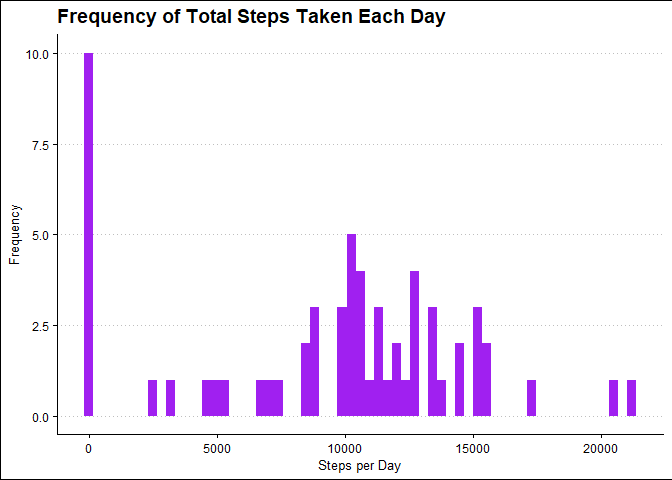
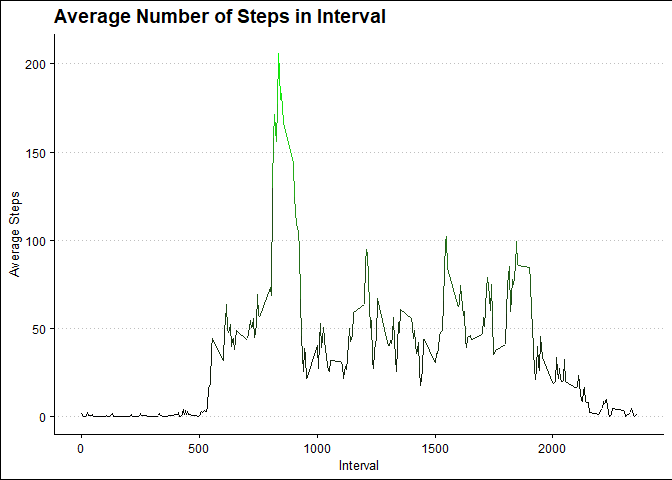
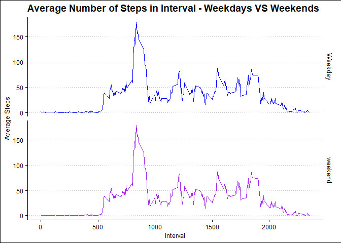

## Introduction

It is now possible to collect a large amount of data about personal movement using activity monitoring devices such as a Fitbit, Nike Fuelband, or Jawbone Up. These type of devices are part of the “quantified self” movement – a group of enthusiasts who take measurements about themselves regularly to improve their health, to find patterns in their behavior, or because they are tech geeks. But these data remain under-utilized both because the raw data are hard to obtain and there is a lack of statistical methods and software for processing and interpreting the data.

This assignment makes use of data from a personal activity monitoring device. This device collects data at 5 minute intervals through out the day. The data consists of two months of data from an anonymous individual collected during the months of October and November, 2012 and include the number of steps taken in 5 minute intervals each day.

The data for this assignment can be downloaded from the course web site:

* Dataset: [Activity monitoring data](https://d396qusza40orc.cloudfront.net/repdata%2Fdata%2Factivity.zip) 

The variables included in this dataset are:

steps: Number of steps taking in a 5-minute interval (missing values are coded as 𝙽𝙰) </br>
date: The date on which the measurement was taken in YYYY-MM-DD format </br>
interval: Identifier for the 5-minute interval in which measurement was taken </br>
The dataset is stored in a comma-separated-value (CSV) file and there are a total of 17,568 observations in this dataset. 


## libraries


```r
library(ggplot2)
library(dplyr)
```

```
## 
## Attaching package: 'dplyr'
```

```
## The following objects are masked from 'package:stats':
## 
##     filter, lag
```

```
## The following objects are masked from 'package:base':
## 
##     intersect, setdiff, setequal, union
```

```r
library(lubridate)
```

```
## 
## Attaching package: 'lubridate'
```

```
## The following objects are masked from 'package:base':
## 
##     date, intersect, setdiff, union
```

```r
library(ggthemes)
library(xtable)
```


## Loading and preprocessing the data

change date column from char to date


```r
setwd("C:\\Users\\Owner\\Documents\\GitHub\\RepData_PeerAssessment1")

df <-read.csv("activity.csv")

df$date <- ymd(df$date)
```


## What is mean total number of steps taken per day?


1.Calculate the total number of steps taken per day


```r
df_group <-df %>%
group_by(date)%>%
    summarise(steps=sum(steps,na.rm = TRUE))
```

```
## `summarise()` ungrouping output (override with `.groups` argument)
```

```r
xt<-xtable(df_group)
print(xt,type = "html") 
```

<!-- html table generated in R 4.0.2 by xtable 1.8-4 package -->
<!-- Mon Aug 03 00:20:30 2020 -->
<table border=1>
<tr> <th>  </th> <th> date </th> <th> steps </th>  </tr>
  <tr> <td align="right"> 1 </td> <td align="right"> 15614.00 </td> <td align="right">   0 </td> </tr>
  <tr> <td align="right"> 2 </td> <td align="right"> 15615.00 </td> <td align="right"> 126 </td> </tr>
  <tr> <td align="right"> 3 </td> <td align="right"> 15616.00 </td> <td align="right"> 11352 </td> </tr>
  <tr> <td align="right"> 4 </td> <td align="right"> 15617.00 </td> <td align="right"> 12116 </td> </tr>
  <tr> <td align="right"> 5 </td> <td align="right"> 15618.00 </td> <td align="right"> 13294 </td> </tr>
  <tr> <td align="right"> 6 </td> <td align="right"> 15619.00 </td> <td align="right"> 15420 </td> </tr>
  <tr> <td align="right"> 7 </td> <td align="right"> 15620.00 </td> <td align="right"> 11015 </td> </tr>
  <tr> <td align="right"> 8 </td> <td align="right"> 15621.00 </td> <td align="right">   0 </td> </tr>
  <tr> <td align="right"> 9 </td> <td align="right"> 15622.00 </td> <td align="right"> 12811 </td> </tr>
  <tr> <td align="right"> 10 </td> <td align="right"> 15623.00 </td> <td align="right"> 9900 </td> </tr>
  <tr> <td align="right"> 11 </td> <td align="right"> 15624.00 </td> <td align="right"> 10304 </td> </tr>
  <tr> <td align="right"> 12 </td> <td align="right"> 15625.00 </td> <td align="right"> 17382 </td> </tr>
  <tr> <td align="right"> 13 </td> <td align="right"> 15626.00 </td> <td align="right"> 12426 </td> </tr>
  <tr> <td align="right"> 14 </td> <td align="right"> 15627.00 </td> <td align="right"> 15098 </td> </tr>
  <tr> <td align="right"> 15 </td> <td align="right"> 15628.00 </td> <td align="right"> 10139 </td> </tr>
  <tr> <td align="right"> 16 </td> <td align="right"> 15629.00 </td> <td align="right"> 15084 </td> </tr>
  <tr> <td align="right"> 17 </td> <td align="right"> 15630.00 </td> <td align="right"> 13452 </td> </tr>
  <tr> <td align="right"> 18 </td> <td align="right"> 15631.00 </td> <td align="right"> 10056 </td> </tr>
  <tr> <td align="right"> 19 </td> <td align="right"> 15632.00 </td> <td align="right"> 11829 </td> </tr>
  <tr> <td align="right"> 20 </td> <td align="right"> 15633.00 </td> <td align="right"> 10395 </td> </tr>
  <tr> <td align="right"> 21 </td> <td align="right"> 15634.00 </td> <td align="right"> 8821 </td> </tr>
  <tr> <td align="right"> 22 </td> <td align="right"> 15635.00 </td> <td align="right"> 13460 </td> </tr>
  <tr> <td align="right"> 23 </td> <td align="right"> 15636.00 </td> <td align="right"> 8918 </td> </tr>
  <tr> <td align="right"> 24 </td> <td align="right"> 15637.00 </td> <td align="right"> 8355 </td> </tr>
  <tr> <td align="right"> 25 </td> <td align="right"> 15638.00 </td> <td align="right"> 2492 </td> </tr>
  <tr> <td align="right"> 26 </td> <td align="right"> 15639.00 </td> <td align="right"> 6778 </td> </tr>
  <tr> <td align="right"> 27 </td> <td align="right"> 15640.00 </td> <td align="right"> 10119 </td> </tr>
  <tr> <td align="right"> 28 </td> <td align="right"> 15641.00 </td> <td align="right"> 11458 </td> </tr>
  <tr> <td align="right"> 29 </td> <td align="right"> 15642.00 </td> <td align="right"> 5018 </td> </tr>
  <tr> <td align="right"> 30 </td> <td align="right"> 15643.00 </td> <td align="right"> 9819 </td> </tr>
  <tr> <td align="right"> 31 </td> <td align="right"> 15644.00 </td> <td align="right"> 15414 </td> </tr>
  <tr> <td align="right"> 32 </td> <td align="right"> 15645.00 </td> <td align="right">   0 </td> </tr>
  <tr> <td align="right"> 33 </td> <td align="right"> 15646.00 </td> <td align="right"> 10600 </td> </tr>
  <tr> <td align="right"> 34 </td> <td align="right"> 15647.00 </td> <td align="right"> 10571 </td> </tr>
  <tr> <td align="right"> 35 </td> <td align="right"> 15648.00 </td> <td align="right">   0 </td> </tr>
  <tr> <td align="right"> 36 </td> <td align="right"> 15649.00 </td> <td align="right"> 10439 </td> </tr>
  <tr> <td align="right"> 37 </td> <td align="right"> 15650.00 </td> <td align="right"> 8334 </td> </tr>
  <tr> <td align="right"> 38 </td> <td align="right"> 15651.00 </td> <td align="right"> 12883 </td> </tr>
  <tr> <td align="right"> 39 </td> <td align="right"> 15652.00 </td> <td align="right"> 3219 </td> </tr>
  <tr> <td align="right"> 40 </td> <td align="right"> 15653.00 </td> <td align="right">   0 </td> </tr>
  <tr> <td align="right"> 41 </td> <td align="right"> 15654.00 </td> <td align="right">   0 </td> </tr>
  <tr> <td align="right"> 42 </td> <td align="right"> 15655.00 </td> <td align="right"> 12608 </td> </tr>
  <tr> <td align="right"> 43 </td> <td align="right"> 15656.00 </td> <td align="right"> 10765 </td> </tr>
  <tr> <td align="right"> 44 </td> <td align="right"> 15657.00 </td> <td align="right"> 7336 </td> </tr>
  <tr> <td align="right"> 45 </td> <td align="right"> 15658.00 </td> <td align="right">   0 </td> </tr>
  <tr> <td align="right"> 46 </td> <td align="right"> 15659.00 </td> <td align="right">  41 </td> </tr>
  <tr> <td align="right"> 47 </td> <td align="right"> 15660.00 </td> <td align="right"> 5441 </td> </tr>
  <tr> <td align="right"> 48 </td> <td align="right"> 15661.00 </td> <td align="right"> 14339 </td> </tr>
  <tr> <td align="right"> 49 </td> <td align="right"> 15662.00 </td> <td align="right"> 15110 </td> </tr>
  <tr> <td align="right"> 50 </td> <td align="right"> 15663.00 </td> <td align="right"> 8841 </td> </tr>
  <tr> <td align="right"> 51 </td> <td align="right"> 15664.00 </td> <td align="right"> 4472 </td> </tr>
  <tr> <td align="right"> 52 </td> <td align="right"> 15665.00 </td> <td align="right"> 12787 </td> </tr>
  <tr> <td align="right"> 53 </td> <td align="right"> 15666.00 </td> <td align="right"> 20427 </td> </tr>
  <tr> <td align="right"> 54 </td> <td align="right"> 15667.00 </td> <td align="right"> 21194 </td> </tr>
  <tr> <td align="right"> 55 </td> <td align="right"> 15668.00 </td> <td align="right"> 14478 </td> </tr>
  <tr> <td align="right"> 56 </td> <td align="right"> 15669.00 </td> <td align="right"> 11834 </td> </tr>
  <tr> <td align="right"> 57 </td> <td align="right"> 15670.00 </td> <td align="right"> 11162 </td> </tr>
  <tr> <td align="right"> 58 </td> <td align="right"> 15671.00 </td> <td align="right"> 13646 </td> </tr>
  <tr> <td align="right"> 59 </td> <td align="right"> 15672.00 </td> <td align="right"> 10183 </td> </tr>
  <tr> <td align="right"> 60 </td> <td align="right"> 15673.00 </td> <td align="right"> 7047 </td> </tr>
  <tr> <td align="right"> 61 </td> <td align="right"> 15674.00 </td> <td align="right">   0 </td> </tr>
   </table>


2.Histogram of the total number of steps taken each day


```r
a<-ggplot(df_group,aes(steps)) +theme_clean()

a+ geom_histogram(bins = 61, fill = "purple")+
    xlab("Steps per Day")+
    ylab("Frequency")+
    ggtitle("Frequency of Total Steps Taken Each Day")
```

<!-- -->


3.Mean and median number of steps taken each day


```r
step_mean <- mean(df_group$steps , na.rm = TRUE)
step_median<-median(df_group$steps, na.rm = TRUE)


list <- list(Steps_Mean =step_mean  ,Steps_Median=step_median)


list
```

```
## $Steps_Mean
## [1] 9354.23
## 
## $Steps_Median
## [1] 10395
```


## What is the average daily activity pattern?


4.Time series plot of the average number of steps taken


```r
df_group_interval <-df %>%
group_by(interval)%>%
    summarise(steps=mean(steps,na.rm = TRUE))
```

```
## `summarise()` ungrouping output (override with `.groups` argument)
```

```r
b<- ggplot(df_group_interval,aes(interval,steps)) +geom_line(aes(color=steps))

b+theme_clean()+
    scale_color_gradient(low = "black", high = "green")+
    theme(legend.position = "none")+
    ggtitle("Average Number of Steps in Interval")+
    xlab("Interval") + ylab("Average Steps")
```

<!-- -->

5.The 5-minute interval that, on average, contains the maximum number of steps


```r
df_group_interval<-arrange(df_group_interval,desc(steps))

head(df_group_interval,1)
```

```
## # A tibble: 1 x 2
##   interval steps
##      <int> <dbl>
## 1      835  206.
```


## Imputing missing values


6.Code to describe and show a strategy for imputing missing data

Calculate and report the total number of missing values in the dataset (i.e. the total number of rows with 𝙽𝙰s


```r
sum(is.na(df))
```

```
## [1] 2304
```

Devise a strategy for filling in all of the missing values in the dataset.

replace all missing with steps median


```r
df$steps[is.na(df$steps)] <- median(df$steps, na.rm = TRUE)

df_fixed<-df

sum(is.na(df_fixed))
```

```
## [1] 0
```

7.Histogram of the total number of steps taken each day after missing values are imputed


```r
df_group2 <-df_fixed %>%
group_by(date)%>%
    summarise(steps=sum(steps))
```

```
## `summarise()` ungrouping output (override with `.groups` argument)
```

```r
c<-ggplot(df_group2,aes(steps)) +theme_clean()

c+ geom_histogram(bins = 61, fill = "purple")+
    xlab("Steps per Day")+
    ylab("Frequency")+
    ggtitle("Frequency of Total Steps Taken Each Day")
```

<!-- -->

meana and median difference after replacing NA values


```r
step_mean2 <- mean(df_group2$steps , na.rm = TRUE)
step_median2<-median(df_group2$steps, na.rm = TRUE)


list <- list(Steps_Mean =step_mean2  ,Steps_Median=step_median2)


list
```

```
## $Steps_Mean
## [1] 9354.23
## 
## $Steps_Median
## [1] 10395
```


## Are there differences in activity patterns between weekdays and weekends


There were no differences since the median for the steps variable was 0


8.Panel plot comparing the average number of steps taken per 5-minute interval across weekdays and weekends

Create a new factor variable in the dataset with two levels – “weekday” and “weekend” indicating whether a given date is a weekday or weekend day


```r
df_fixed$day<-wday(df_fixed$date)


weekday <- c(2,3,4,5,6)
weekend <- c(7,1)


df_fixed <- df_fixed %>% 
    mutate( day_binary = case_when(
        df_fixed$day %in% weekday ~ "Weekday",
        df_fixed$day %in% weekend ~ "weekend"))
```


Panel plot


```r
df_group_interval2 <-df_fixed %>%
group_by(interval)%>%
    summarise(steps=mean(steps,na.rm = TRUE),
              days=as.factor(day_binary))
```

```
## `summarise()` regrouping output by 'interval' (override with `.groups` argument)
```

```r
b<- ggplot(df_group_interval2,aes(interval,steps,color = as.numeric(days))) +geom_line()

b+theme_clean()+
    facet_grid(days~.)+
    scale_color_gradient(low = "blue", high = "purple")+
    theme(legend.position = "none")+
    ggtitle("Average Number of Steps in Interval - Weekdays VS Weekends")+
    xlab("Interval") + ylab("Average Steps")
```

<!-- -->


